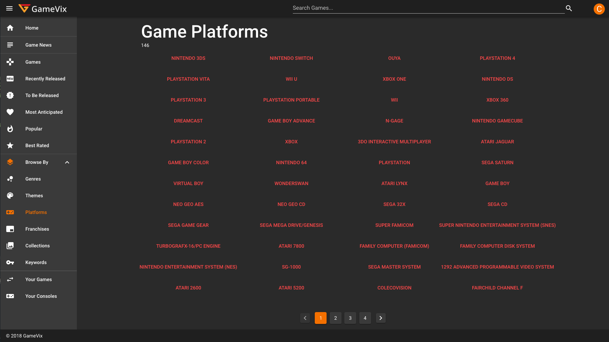

Was live on www.gamevix.com

https://www.google.com/search?q=%22gamevix%22

## MVP
- Homepage
  - How it works
  - Other SEO stuff
- Browse Page
  - Browse slug pages
    - Pagination
- Game Detail Page
  - Metadata (TBD)
   - Title
   - Description  
   - Category Root
   - Stock Photos
   - Retailer links
   - Related Products
- Member
  - Sign Up / Login
    - Facebook
    - Email verification
    - Forgot/reset password
  - Profile
    - Name
    - Avatar
    - Address (private)
  - Account Settings
    - Email
    - Password
    - Payment methods
      - Stripe
      - Braintree
  - Inventory
    - List of games owned
      - CRUD
      - Barcode scan
  - Swap Queues
    - Going out queue
      - choose from inventory
    - Want in queue
    - *Algo* to tell which to which
      - Evaluate system-wide swap efficiency
  - Swap details
    - Game out
      - Mail tracking
    - Game in
      - Mail tracking
    - Status
  - Swap history (list of Swap details)
- Search
  - Search Results Page (let's try to match Amazon's)
  - Deep link
- SEO
  - Link Structures
  - no-index, no-follows for outbound links
  - Canonical Urls
  - Vanity Urls
  - Slugs
  - Structured Data for all public pages https://developers.google.com/search/docs/guides/intro-structured-data
- Social Sharing of (selected) inventory / swap history
  - Facebook
  - Instagram
  - Twitter
  - Email
- Legal/Static Contents
  - Terms of Service
  - Privacy Policy
  - How It Works
  - FAQ
  - Contact
  - About
  
- Rewards / Gamification (optional)
  - Tasks
    - Registration
    - Facebook Linking
    - Social Sharing
    - Referal Sign Up
    - Referal Traffic
  - Reward coins
    - Usages
      - Membership
      - Swap priority
      - Free game discs

### Sails Links

+ [Sails framework documentation](https://sailsjs.com/documentation)
+ [Version notes / upgrading](https://sailsjs.com/documentation/upgrading)
+ [Deployment tips](https://sailsjs.com/documentation/concepts/deployment)
+ [Community support options](https://sailsjs.com/support)
+ [Professional / enterprise options](https://sailsjs.com/studio)

### Nuxt/Vue Links
- [Official Website](https://nuxtjs.org/)
- [Github Repos](https://github.com/nuxt)
- [twitter](https://twitter.com/nuxt_js)
- [Gitter Channel](https://gitter.im/nuxt/nuxt.js)
- [Vue](https://vuejs.org/)

### Vuetify Links
- [Official Website](https://vuetifyjs.com/)
- [Gitter Channel](https://gitter.im/vuetifyjs/Lobby/~chat#)
- [Twitter](https://twitter.com/vuetifyjs)
- [Github Repo](https://github.com/vuetifyjs/vuetify)
